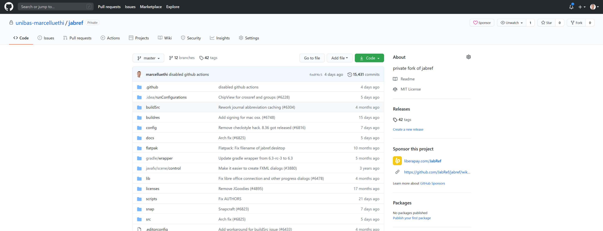

# Praktische Übung 1: Setup von JabRef

## Administratives

* Sie sollten diese Übung wenn möglich bis am nächsten Tag bearbeitet haben.

## Einführung

Für die meisten Übungen in diesem Kurs werden Sie das Open Source Projekt [JabRef](https://www.jabref.org/) verwenden.
In dieser ersten Übung werden Sie alle wichtigen Tools und die Entwicklungsumgebung aufsetzten, um im folgenden Änderungen und Erweiterungen im Code vornehmen zu können.


## Benutzeraccount auf Github
Falls Sie noch keinen Benutzeraccount auf [Github](https://www.github.com) haben, erstellen Sie bitte einen. Teilen Sie uns Ihren Github Benutzernamen sowie Ihre Uni Basel E-Mail  Adresse via E-Mail an [marcel.luethi@unibas.ch](mailto:marcel.luethi@unibas.ch) mit, damit wir Ihnen Zugriff auf das Code-Repository geben können.

*Auf Github ist dieser Benutzername sehr prominent und wird auch in der Projektkommunikation verwendet. Achten Sie deshalb bitte darauf, dass Sie einen Benutzernamen wählen, der professionelles Arbeiten zulässt. Gute Beispiele sind: ```andreasmeier``` oder ```andreas``` oder ```ameier```. Beispiele von ungeeigneten Namen sind ```coderking```, ```cookiemonster``` oder ```skaterboy```.*


## Installation der Entwicklungswerkzeuge

### Git

Installieren Sie das Versionsverwaltungswerkzeug *Git*, welches Sie auf der offiziellen [Git Webseite](https://git-scm.com/) herunterladen können.

#### Test der Installation

Öffnen Sie ein Terminal. Eingabe von
```bash
> git --version
```
sollte die Version von Git ausgeben, also z.B.
```bash
> git version 2.33.0.windows.1
```

#### Git Konfiguration
Als nächstes müssen Sie git noch mit ihrem Namen und Ihrer E-Mail Adresse konfigurieren. Öffnen Sie dazu ein Terminal und geben Sie folgendes ein:

```bash
git config --global user.name "Your Name"
git config --global user.email "youremail@yourdomain.com"
```

Nutzen Sie hierzu die E-Mail Adresse, die Sie auch für die Erzeugung vom Github Account verwendet haben.


#### Einrichten von SSH zur sicheren Kommunikation zwischen git und github

Um via Git auf ihr Github repository zugreifen zu können, müssen Sie ssh (secure shell) einrichten.
Bitte konsultieren Sie dazu die [Github Dokumentation](
https://docs.github.com/en/github/authenticating-to-github/connecting-to-github-with-ssh/generating-a-new-ssh-key-and-adding-it-to-the-ssh-agent
), welche diesen Schritt für die drei wichtigen Betriebssysteme (Windows, Linux und MacOS) detailliert beschreibt.

### Installieren von Java

Für die Entwicklung von JabRef nutzen wir Java in der Version 18. Wir empfehlen Ihnen die Version 
von Eclipse Temurin, die Sie [hier](https://adoptium.net/temurin/releases?version=18) herunterladen
können. 

--
Um zu überprüfen ob Java korrekt auf Ihrem System verfügbar ist, öffnen Sie ein Terminal, und setzen die
Umgebungsvariable ```JAVA_HOME``` und ```PATH``` wie hier Beispielhaft für die Windows Powershell gezeigt:
```
$env:JAVA_HOME="C:\Program Files\Eclipse Adoptium\jdk-18.0.1.10-hotspot
$env:PATH="C:\Program Files\Eclipse Adoptium\jdk-18.0.1.10-hotspot\bin" 
```
auf das neu installierte JDK. Dann geben Sie folgendes Kommando ein:
```
 java -version
```
Die Ausgabe sollte ungefähr wie folgt aussehen:
```bash
openjdk version "18.0.1" 2022-04-19
OpenJDK Runtime Environment Temurin-18.0.1+10 (build 18.0.1+10)
OpenJDK 64-Bit Server VM Temurin-18.0.1+10 (build 18.0.1+10, mixed mode, sharing)
```

## JabRef

Nachdem wir nun alle Werkzeuge installiert haben, müssen wir noch das JabRef Projekt herunterladen. Dies geschieht via Github.

### Forken des Github Repositories
Im ersten Teil dieses Kurses arbeiten wir nicht mit dem offiziellen JabRef Code repository, sondern mit einem privaten Fork. Damit sind ihre Änderungen und unsere Bemerkungen für die Öffentlichkeit nicht zugänglich.
Damit Sie auf unseren Fork von JabRef zugreifen können, müssen wir Ihnen Zugriff auf dieses Repository geben. Sie können überprüfen ob Sie Zugriff haben indem Sie auf [https://github.com/unibas-marcelluethi/jabref](https://github.com/unibas-marcelluethi/jabref) gehen.
Falls Sie bereits Zugriff haben, sollte die Seite etwa wie folgt aussehen:



Nun erstellen Sie, ausgehend von unserem privaten Fork, ihren eigenen privaten Fork. Dazu klicken Sie oben rechts auf den "Fork" Button. Nach erfolgreichem Fork landen Sie nun auf Ihrer persönlichen Kopie des Projekts auf Github, mit der Sie von nun an arbeiten werden.

### Klonen des Projekts

Damit Sie an dem Projekt arbeiten können müssen Sie das Repository noch auf Ihren eigenen Computer bringen (d.h. das Repository "klonen"). Drücken Sie den grünen Button mit Namen "Code" und kopieren Sie die URL.

Öffnen Sie eine Konsole, wechseln Sie in ihr gewünschtes Arbeitsverzeichnis und geben Sie folgendes ein:

```
git clone THE_URL_FOR_YOUR_PROJECT
```

### Kompilieren des Projekts von der Kommandozeile

Bevor Sie das Projekt in der IDE bearbeiten, versuchen Sie es zuerst von der Kommandozeile zu kompilieren und auszuführen.

Dazu wechseln Sie zuerst in das Verzeichnis ```jabref```:

```
cd jabref
```

Dann führen Sie folgende Kommandos aus (unter Linux und MacOS muss .\ durch ./ ersetzt werden):

```
.\gradlew compileJava
```

Mit dem Befehl
```
.\gradlew run
```
können Sie das Projekt dann starten.

## Bearbeiten des Projekts in der IDE

### IntelliJ Idea

Installieren Sie die Entwicklungsumgebung [IntelliJ IDEA](https://www.jetbrains.com/idea/). Informationen zu Download und Installation finden Sie auf der [Seite von JetBrains](https://www.jetbrains.com/idea/).

*Bemerkung 1:* Wir arbeiten in diesem Kurs mit der *Community Edition*, die als Open Source uneingeschränkt zugänglich ist.

Öffnen Sie nun Ihre JabRef Projekt in IntelliJ Idea, indem Sie auf dem *Welcome Screen* auf *Open*  gehen oder, falls Sie sich schon in der IDE befinden, im Menu *File->Open* wählen. Dann wählen Sie die Datei ```build.gradle``` in Ihrem JabRef Verzeichnis.

Nun müssen Sie die Einstellungen in IntelliJ noch für die Entwicklung von JabRef anapssen. Wie das geht ist detailliert in der JabRef [Development Documentation](https://devdocs.jabref.org/getting-into-the-code/guidelines-for-setting-up-a-local-workspace#configure-your-ide) erklärt.
Lesen Sie die Erklärung durch und führen Sie alle Einstellungen wie angegeben durch.  Den Abschnitt *Using IntelliJ's internal build system* können Sie überspringen, da dies nicht zuverlässig funktioniert und wir das Projekt deshalb immer via Gradle bauen uns ausführen werden.
Aktivieren Sie aber Checkstyle, wie im Abschnitt *Using JabRef's code style* beschrieben. Damit wird sichergestellt, dass ihr Code jeweils nach den Projektvorgaben formatiert ist.
Falls Sie unter *Tools* keinen Eintrag Checkstyle finden sollten, müssen Sie zuerst noch das Checkstyle plugin installieren(via *File->Settings->Plugins*).


### Ausführen des Projekts aus der IDE

Um JabRef aus der IDE zu starten öffnen Sie das Gradle Fenster und starten die Gradle Task *jabref [run]* indem Sie diese Doppelklicken (siehe Screenshot).


Wenn alles funktioniert hat, sollte nun JabRef erfolgreich aus der IDE gestartet werden können.

### Alles erfolgreich installiert?
Sie können uns Ihren Erfolg gerne im [Diskussionforum](https://github.com/unibas-marcelluethi/jabref/discussions) mitteilen. 


